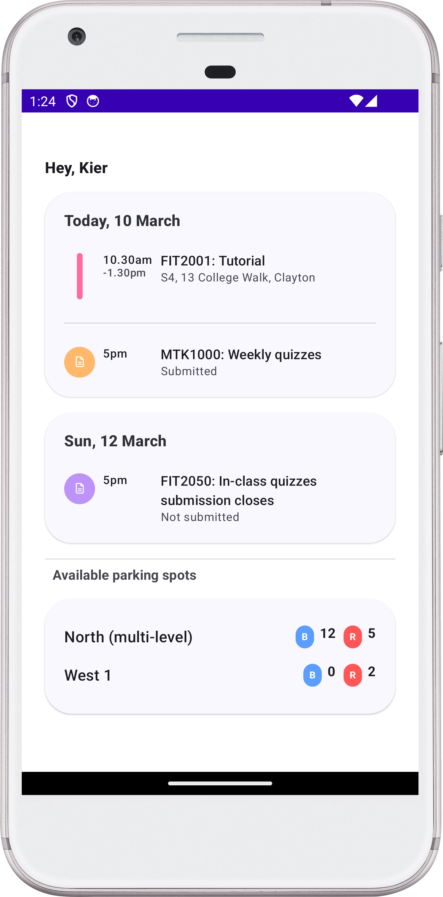
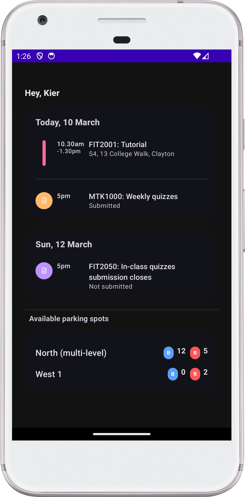

# StudentDahoard App

## Checklist
- [x] Describe architecture & layers
- [x] Document tech stack and key libraries (Coroutines Flow, Hilt, Compose, etc.)
- [x] Explain Figma Dev Mode MCP usage
- [x] Highlight reusable components & previews
- [x] Summarize tests, automation, and lint
- [x] Embed dashboard screenshots

## Overview
MonashApp is a single-screen Android dashboard built with Kotlin, Jetpack Compose, and MVVM/Clean architecture. The experience is powered entirely by local data and emphasizes design-system compliance and accessibility.

|Dashboard Light| Dashboard Dark|
|---------------|----------------|
|||

## Architecture
- **Presentation (app/src/main/java/com/example/monashapp/dashboard/presentation/)**: `DashboardViewModel` exposes immutable `DashboardUiState` via `StateFlow`, reacts to `DashboardUiEvent`, and orchestrates UI updates.
- **Domain (app/src/main/java/com/example/monashapp/dashboard/domain/)**: `DashboardRepository` interface and `GetDashboardDataUseCase` encapsulate business logic with coroutine-friendly contracts.
- **Data (app/src/main/java/com/example/monashapp/dashboard/data/)**: `DashboardRepositoryImpl` adapts `DashboardLocalDataSource` (currently `FakeDashboardLocalDataSource`) into domain models using mapper extensions.
- **UI (app/src/main/java/com/example/monashapp/dashboard/ui/)**: Pure composables render the dashboard via `DashboardScreen`, `DashboardContent`, and reusable components under `ui/components` (e.g., `DashboardToolbar`, `CardTile`, `EventCell`, `SectionTitle`, `SmallCell`).
- **Dependency Injection**: `DashboardModule` (Hilt) binds local data source, repository, and use case at the `SingletonComponent` scope. `MonashApplication` is annotated with `@HiltAndroidApp` to bootstrap DI.

## Tech Stack & Key Libraries
| Category | Libraries |
| --- | --- |
| Language & Coroutines | Kotlin 2.0.x, Kotlin Coroutines (`kotlinx.coroutines-core`, `kotlinx.coroutines-test`), Flow-based state streams |
| UI | Jetpack Compose BOM (Material 3, Foundation, Icons), Compose Tooling/Previews |
| Lifecycle | `androidx.lifecycle` runtime & compose integration |
| Dependency Injection | Hilt (`com.google.dagger:hilt-android`, `androidx.hilt: hilt-navigation-compose`) |
| Async & Testing | Turbine for Flow testing, JUnit4, AndroidX Test, Espresso |
| Build | AGP 8.7.x, Kotlin Compose Compiler plugin, Gradle 8.9 |

### Coroutine Flow Usage
- `DashboardViewModel` exposes `StateFlow<DashboardUiState>` collected in UI via `collectAsStateWithLifecycle`.
- Repositories/local data sources emit `Flow<DashboardData>` ensuring reactive updates.

### Hilt Usage
- Constructor injection across local data layer and use cases.
- Annotated module ensures static provisioning of singletons required by Compose UI and tests.

## Figma Dev Mode MCP Workflow
Design fidelity relies on the repository’s `.github/copilot-instructions.md` and `docs/copilot-*.md` guidelines:
1. Developers export tokens/components from Figma Dev Mode via MCP.
2. Compose code maps tokens to Android resources (`colors.xml`, `dimens.xml`, typography styles).
3. README references: `docs/copilot-figma-devmode.md`, `docs/copilot-design-system.md` for detailed workflow.
4. Components were derived from Figma specs, ensuring spacing (`@dimen/spacing_*`), typography, and color tokens match the design system.

## Reusable Components
Located in `app/src/main/java/com/example/monashapp/dashboard/ui/components/`:
- `DashboardToolbar`: themed top app bar with avatar + actions.
- `SectionTitle`: standard header with divider support.
- `EventCell`: versatile list item supporting sessions and tasks via `EventIcon` + `EventTime` models.
- `CardTile`, `SmallCell`: used for cards and metric displays.
- Composables accept data models (`DashboardItem.Session`, `DashboardItem.Task`, `DashboardItem.Parking`) to ensure testability and reuse.

## Compose Previews & Sticker Sheets
- `DashboardScreenPopulatedPreview`, `DashboardScreenAccessibilityPreview`, `DashboardScreenLandscapePreview`, `DashboardScreenEmptyPreview` provide multi-device previews using custom annotations (`PreviewLightDark`, `PreviewFontScales`, `PreviewLandscape`).
- `Screenshots/` folder captures generated previews for README visuals.

## Testing & Automation
- **Unit Tests** (`app/src/test/...`):
  - `DashboardViewModelTest` validates initial state, Flow emissions, and event handling using `runTest`, Turbine, and fake repositories.
  - Mappers/tests ensure data conversions remain deterministic.
- **UI Tests** (`app/src/androidTest/...`):
  - `DashboardScreenTest` uses a Robot DSL (`DashboardRobot`) built on Compose testing APIs (assertions, scroll helpers) to verify sections, tasks, and accessibility text.
- **Screenshot Tests**: TODO
- **Automation**:
  - `./gradlew assembleDebug`, `./gradlew testDebugUnitTest`, `./gradlew lintDebug`, `./gradlew assembleDebugAndroidTest` are used to validate builds, tests, lint, and instrumentation.
  - Lint baseline prevents regressions while highlighting new warnings (e.g., dependency updates).

## Lint & Quality Gates
- Custom `lint {}` block enables HTML/XML/SARIF outputs and text logs under `app/stdout`.
- `lint-baseline.xml` tracks historical warnings; pipeline focuses on newly introduced issues.
- Reports stored under `app/build/reports/lint/` and referenced during PR reviews.

## How to Run Locally
```bash
./gradlew assembleDebug
./gradlew testDebugUnitTest
./gradlew lintDebug
```
Need instrumentation tests? Add an emulator/device first, then:
```bash
./gradlew connectedDebugAndroidTest
```

## Further Reading
- `.github/copilot-instructions.md` – repository-wide architectural/design guidance.
- `docs/` folder – Compose previews, lint configuration, and design system rollouts.
- `design/` – placeholder for Figma exports/screenshots referenced in previews.

This README will evolve as new components, tests, or automations land. Contributions should update the relevant sections and screenshot assets to keep documentation accurate.

