# AI-Powered Development Workflow
**MonashApp - Multi-MCP Integration Strategy**

**Version:** 1.0  
**Date:** December 11, 2025  
**Status:** Active  

---

## 📋 Executive Summary

This document defines the AI-powered development workflow integrating three Model Context Protocol (MCP) sources with GitHub Copilot instructions to ensure consistent, high-quality code generation that meets design specifications, accessibility standards, and project conventions.

### Three Pillars of Truth

```
┌─────────────────────────────────────────────────────────────────┐
│                    AI DEVELOPMENT WORKFLOW                       │
└─────────────────────────────────────────────────────────────────┘
                                │
                    ┌───────────┴───────────┐
                    │   GitHub Copilot      │
                    │   (Orchestrator)      │
                    └───────────┬───────────┘
                                │
            ┌───────────────────┼───────────────────┐
            │                   │                   │
    ┌───────▼────────┐  ┌──────▼──────┐  ┌────────▼────────┐
    │  Atlassian MCP │  │  Figma MCP  │  │   GitHub MCP    │
    │ (Requirements) │  │  (Design)   │  │   (History)     │
    └────────────────┘  └─────────────┘  └─────────────────┘
            │                   │                   │
            │                   │                   │
    ┌───────▼────────┐  ┌──────▼──────┐  ┌────────▼────────┐
    │ • User Stories │  │ • Mockups   │  │ • Past PRs      │
    │ • AC Criteria  │  │ • Tokens    │  │ • Code Patterns │
    │ • Copy/Labels  │  │ • Variables │  │ • Decisions     │
    │ • Analytics    │  │ • Standards │  │ • Issues        │
    │ • A11y Reqs    │  │ • Components│  │ • Discussions   │
    └────────────────┘  └─────────────┘  └─────────────────┘
```

---

## 🎯 Workflow Overview

### Phase 1: Information Gathering (MCP Sources)
### Phase 2: Code Generation (Copilot + Instructions)
### Phase 3: Validation & Quality Checks

```mermaid
graph TB
    A[Start: New Feature Request] --> B{Gather Context}
    
    B --> C1[Atlassian MCP]
    B --> C2[Figma Dev Mode MCP]
    B --> C3[GitHub MCP]
    
    C1 --> D1[Extract Requirements]
    C2 --> D2[Extract Design Specs]
    C3 --> D3[Review Past Patterns]
    
    D1 --> E[Synthesize Context]
    D2 --> E
    D3 --> E
    
    E --> F[Load Copilot Instructions]
    F --> G[Generate Code]
    
    G --> H{Validation}
    H -->|Pass| I[Commit & PR]
    H -->|Fail| J[Fix Issues]
    J --> H
    
    I --> K[End]
    
    style C1 fill:#0052CC
    style C2 fill:#F24E1E
    style C3 fill:#181717
    style F fill:#22863a
    style H fill:#ffd700
```



---

## 🔧 System Architecture

### Current Project Setup

```
MonashApp/
├── .github/
│   ├── copilot-instructions.md          # 🎯 Main orchestrator
│   ├── instructions/                     # 📚 Domain-specific guides
│   │   ├── ACCESSIBILITY_BEST_PRACTICES.instructions.md
│   │   ├── COMPOSE_BEST_PRACTICES.instructions.md
│   │   ├── COMPOSE_PREVIEW.instructions.md
│   │   ├── DESIGN_SYSTEM.instructions.md
│   │   ├── FIGMA_DEV_MODE.instructions.md
│   │   └── KOTLIN_CODING_CONVENTIONS.instructions.md
│   ├── prompts/                          # 🤖 AI workflows
│   │   ├── SAFE_IMPLEMENT.prompt.md
│   │   └── INSTRUCTIONS.prompt.md
│   └── figma-assets/                     # 🎨 Design exports
├── docs/
│   ├── improvement-plan/                 # 📊 Analysis reports
│   └── past-implementation/              # 📝 Implementation logs
├── design/
│   └── figma-screenshots/                # 📸 Design snapshots
└── app/src/main/
    ├── dashboard/
    │   ├── domain/                       # 🏗️ Business logic
    │   ├── data/                         # 💾 Data layer
    │   └── ui/                           # 🎨 Presentation layer
    │       ├── DashboardTokens.kt        # Design tokens
    │       └── components/               # Reusable components
    └── ui/theme/                         # 🌈 Theme configuration
```

### Tech Stack

- **Language:** Kotlin 2.0.21
- **UI Framework:** Jetpack Compose + Material Design 3
- **Architecture:** MVVM + Clean Architecture
- **DI:** Hilt 2.52
- **Build:** Gradle 8.9 (Kotlin DSL)
- **Testing:** JUnit, Espresso, Compose UI Testing

---

## 🔄 Detailed Workflow Steps

### Step 1: Fetch Requirements (Atlassian MCP)

**Purpose:** Establish source of truth for feature requirements

```
┌─────────────────────────────────────────────────────────────┐
│                    ATLASSIAN MCP (Jira)                     │
├─────────────────────────────────────────────────────────────┤
│ Extract from Issue/Story:                                   │
│ ✓ Acceptance Criteria    → Defines "done"                   │
│ ✓ User Copy/Labels        → Exact text for strings.xml      │
│ ✓ Figma Links            → Design references                │
│ ✓ Accessibility Req       → WCAG compliance needs            │
│ ✓ Analytics Events        → Tracking requirements           │
│ ✓ Business Rules          → Logic constraints               │
└─────────────────────────────────────────────────────────────┘
```

**AI Prompt Template:**
```
Fetch Jira issue [SCRUM-XXX] via Atlassian MCP:
1. Extract acceptance criteria
2. List all Figma design links
3. Note accessibility requirements
4. Identify required copy/labels
5. Document analytics events
6. Capture any technical constraints
```

**Example Output:**
```yaml
issue: SCRUM-1
title: "Implement SmallCell Component"
acceptance_criteria:
  - Badge circles must be 24dp (Figma spec)
  - Support light/dark themes
  - Screen reader accessible
copy:
  - "spots available"
figma_links:
  - "https://figma.com/design/.../node-id=54-396"
accessibility:
  - Touch target min 48dp
  - Proper semantic labels
analytics:
  - track_parking_cell_viewed
```

---

### Step 2: Extract Design Specs (Figma Dev Mode MCP)

**Purpose:** Get pixel-perfect design specifications and ensure component standards

```
┌─────────────────────────────────────────────────────────────┐
│                 FIGMA DEV MODE MCP                          │
├─────────────────────────────────────────────────────────────┤
│ Extract from Node:                                          │
│ ✓ Component Anatomy       → Structure & hierarchy           │
│ ✓ Design Tokens           → Spacing, colors, typography     │
│ ✓ Design Variables        → Dynamic values                  │
│ ✓ Component Naming        → Consistent nomenclature         │
│ ✓ Variants & States       → All interaction states          │
│ ✓ Assets (images/icons)   → Export to design/ folder        │
└─────────────────────────────────────────────────────────────┘
```

**AI Prompt Template:**
```
Fetch Figma node [node-id] via Figma MCP:
1. Get component structure (get_design_context)
2. Extract design tokens (get_variable_defs)
3. Capture screenshot (get_screenshot)
4. Export assets to design/figma-screenshots/
5. Map to Android resources:
   - Colors → colors.xml / theme attrs
   - Spacing → DashboardTokens.kt
   - Typography → MaterialTheme.typography
```

**Validation Checklist:**
- [ ] Component follows Figma naming convention
- [ ] Uses design tokens (no hardcoded values)
- [ ] All variants accounted for
- [ ] Assets properly exported
- [ ] Design system compliant

---

### Step 3: Review Historical Context (GitHub MCP)

**Purpose:** Learn from past implementations and avoid repeating mistakes

```
┌─────────────────────────────────────────────────────────────┐
│                     GITHUB MCP                              │
├─────────────────────────────────────────────────────────────┤
│ Search & Analyze:                                           │
│ ✓ Similar Components      → Code patterns to reuse          │
│ ✓ Past PRs                → Implementation approaches        │
│ ✓ Code Reviews            → Design decisions & feedback     │
│ ✓ Issues & Discussions    → Known problems & solutions      │
│ ✓ Recent Changes          → Avoid conflicts                 │
│ ✓ Test Patterns           → Testing strategies              │
└─────────────────────────────────────────────────────────────┘
```

**AI Prompt Template:**
```
Search GitHub via GitHub MCP:
1. Find similar components (search_code: "EventCell" language:Kotlin)
2. Review recent PRs on dashboard UI (list_pull_requests)
3. Check past component implementations (get_file_contents)
4. Look for related issues (search_issues: "SmallCell OR parking")
5. Review test patterns (search_code: "@Preview" path:components/)
```

**Learning Points:**
- Reusable patterns (e.g., `DataPoint` data class)
- Testing approaches (Preview functions)
- Common pitfalls (hardcoded values)
- Architecture decisions (MVVM structure)

---

### Step 4: Apply Copilot Instructions

**Purpose:** Ensure generated code follows project standards

```
┌─────────────────────────────────────────────────────────────┐
│              COPILOT INSTRUCTION HIERARCHY                   │
└─────────────────────────────────────────────────────────────┘
                        │
        ┌───────────────┴───────────────┐
        │                               │
┌───────▼────────┐              ┌──────▼───────┐
│  Repository    │              │   Path       │
│  Instructions  │              │ Instructions │
│  (Global)      │              │  (Specific)  │
└───────┬────────┘              └──────┬───────┘
        │                               │
        │        ┌──────────────┐       │
        └────────►   Prompts    ◄───────┘
                 │  (Workflow)  │
                 └──────┬───────┘
                        │
                ┌───────▼────────┐
                │ Generated Code │
                └────────────────┘
```

**Instruction Layers:**

1. **Repository-wide** (`.github/copilot-instructions.md`)
   - Architecture: MVVM + Clean
   - No hardcoded values
   - Design system tokens
   - Accessibility requirements
   - Testing standards

2. **Domain-specific** (`.github/instructions/*.instructions.md`)
   - Compose best practices
   - Kotlin conventions
   - Design system rules
   - Figma integration
   - Accessibility guidelines

3. **Workflow prompts** (`.github/prompts/*.prompt.md`)
   - SAFE_IMPLEMENT: Step-by-step implementation
   - INSTRUCTIONS: How to use the system

---

### Step 5: Generate Code

**Synthesis Process:**

```
┌─────────────────────────────────────────────────────────────┐
│                    CODE GENERATION                           │
├─────────────────────────────────────────────────────────────┤
│ Input Sources:                                              │
│  [Atlassian] → Requirements & copy                          │
│  [Figma]     → Design specs & tokens                        │
│  [GitHub]    → Code patterns & history                      │
│  [Copilot]   → Standards & conventions                      │
│                                                             │
│ Generation Steps:                                           │
│  1. Create data models                                      │
│  2. Implement composables (stateless)                       │
│  3. Apply design tokens                                     │
│  4. Add accessibility semantics                             │
│  5. Create preview functions                                │
│  6. Write unit tests                                        │
│  7. Update strings.xml                                      │
│                                                             │
│ Output:                                                     │
│  ✓ Type-safe, idiomatic Kotlin                             │
│  ✓ Material Design 3 compliant                             │
│  ✓ Fully accessible                                        │
│  ✓ Testable & maintainable                                 │
└─────────────────────────────────────────────────────────────┘
```

**AI Execution Template:**
```kotlin
// Step 1: Load context from all MCPs
val requirements = atlassianMCP.getIssue("SCRUM-1")
val designSpecs = figmaMCP.getDesignContext(nodeId = "54-396")
val codePatterns = githubMCP.searchCode("similar components")

// Step 2: Apply Copilot instructions
followInstructions([
  "copilot-instructions.md",
  "instructions/COMPOSE_BEST_PRACTICES.instructions.md",
  "instructions/DESIGN_SYSTEM.instructions.md",
  "prompts/SAFE_IMPLEMENT.prompt.md"
])

// Step 3: Generate code
generateComponent {
  name = "SmallCell"
  tokens = designSpecs.extractTokens()
  patterns = codePatterns.bestPractices()
  accessibility = requirements.a11yRequirements()
  tests = true
}
```

---

### Step 6: Validation & Quality Gates

```
┌─────────────────────────────────────────────────────────────┐
│                  VALIDATION PIPELINE                         │
└─────────────────────────────────────────────────────────────┘
                        │
        ┌───────────────┼───────────────┐
        │               │               │
┌───────▼────┐  ┌──────▼──────┐  ┌────▼─────┐
│ Compilation│  │   Linting   │  │  Tests   │
│   Check    │  │   (Lint)    │  │ (JUnit)  │
└───────┬────┘  └──────┬──────┘  └────┬─────┘
        │               │               │
        └───────────────┼───────────────┘
                        │
            ┌───────────▼───────────┐
            │  Design Compliance    │
            │  ✓ Tokens used        │
            │  ✓ No hardcoded vals  │
            │  ✓ A11y attributes    │
            │  ✓ Previews present   │
            └───────────┬───────────┘
                        │
                ┌───────▼────────┐
                │   PR Ready     │
                └────────────────┘
```

**Automated Checks:**

1. **Compilation** (`./gradlew compileDebugKotlin`)
2. **Linting** (`./gradlew lint`)
3. **Unit Tests** (`./gradlew testDebugUnitTest`)
4. **UI Tests** (`./gradlew connectedDebugAndroidTest`)

**Manual Review Checklist:**
- [ ] Matches Figma design pixel-perfectly
- [ ] Uses design system tokens (DashboardTokens, MaterialTheme)
- [ ] No hardcoded strings (uses strings.xml)
- [ ] Accessibility semantics present
- [ ] Preview functions included
- [ ] Tests cover main scenarios
- [ ] Follows Kotlin conventions
- [ ] Clean Architecture maintained

---

## 🤖 AI Prompt Examples

### Example 1: New Component from Figma

```markdown
**Objective:** Implement SmallCell component from Figma design

**Step 1 - Atlassian MCP:**
Fetch SCRUM-1 and extract:
- Acceptance criteria
- Copy/labels
- Accessibility requirements

**Step 2 - Figma MCP:**
Get design context for node-id=54-396:
- Extract spacing tokens (8dp, 12dp, 24dp)
- Map colors to theme attributes
- Export screenshots to design/figma-screenshots/

**Step 3 - GitHub MCP:**
Search for similar list components:
- Review EventCell.kt implementation
- Check DataPoint pattern usage
- Find preview function patterns

**Step 4 - Generate:**
Follow SAFE_IMPLEMENT.prompt.md:
1. Create DataPoint data class
2. Implement SmallCell composable
3. Use DashboardTokens for spacing
4. Add accessibility semantics
5. Create preview functions
6. Update strings.xml

**Step 5 - Validate:**
- Run ./gradlew compileDebugKotlin
- Check for lint warnings
- Verify design system compliance
```

## 📊 Metrics & Success Criteria

### Quality Metrics

| Metric | Target | Measurement |
|--------|--------|-------------|
| Build Success Rate | 100% | `./gradlew build` passes |
| Test Coverage | ≥70% | JaCoCo report |
| Lint Warnings | 0 | `./gradlew lint` clean |
| Design Token Usage | 100% | No hardcoded dp/sp/colors |
| Accessibility Score | 100% | All semantics present |
| Preview Functions | 100% | All components have @Preview |

---

## 🎓 Training & Best Practices

### For AI Assistants

**Golden Rules:**
1. ✅ **Always fetch context first** (Atlassian → Figma → GitHub)
2. ✅ **Load relevant instructions** before generating code
3. ✅ **Use design tokens** - never hardcode values
4. ✅ **Follow SAFE_IMPLEMENT** workflow
5. ✅ **Validate your work** before declaring done
6. ✅ **Document changes** in past-implementation/

**Anti-Patterns to Avoid:**
1. ❌ Generating code without checking Figma specs
2. ❌ Skipping GitHub MCP (missing context from past work)
3. ❌ Ignoring Copilot instructions
4. ❌ Not running compilation checks
5. ❌ Hardcoding values instead of using tokens


## 🔐 Security & Privacy

### MCP Access Controls

| MCP Source | Access Level | Data Exposed |
|------------|--------------|--------------|
| Atlassian | Read-only | Public issue data only |
| Figma | Read-only | Design files (no user data) |
| GitHub | Read/Write* | Code, PRs, Issues |

*Write access limited to branch creation, file updates, PR creation

### Data Handling

- ✅ No credentials in generated code
- ✅ No PII in prompts or outputs
- ✅ Secrets managed via environment variables
- ✅ Design assets versioned in repo (no external deps)

---

## 🚀 Quick Start Guide

### Setting Up the Workflow

1. **Install MCP Servers** (if not already configured)
   - Atlassian MCP for Jira
   - Figma Desktop MCP
   - GitHub MCP

2. **Verify Copilot Configuration**
   ```bash
   # Check instructions are loaded
   ls -la .github/copilot-instructions.md
   ls -la .github/instructions/
   ls -la .github/prompts/
   ```

3. **Test the Workflow**
   ```
   Prompt: "Show me the AI workflow for implementing a new component"
   Expected: AI loads this document and explains the process
   ```

### Using the Workflow (Developer)

```bash
# Step 1: Start with a ticket
"Implement feature from SCRUM-XXX following AI workflow plan"

# Step 2: AI will automatically:
# - Fetch Jira issue
# - Load Figma design
# - Review similar code
# - Generate implementation
# - Run validation

# Step 3: Review & approve
git diff  # Check changes
./gradlew build  # Verify build
git commit -m "feat(dashboard): implement SmallCell component"
```

---

## 📚 Reference Documentation

### Internal Documents

- **[Copilot Instructions](.github/copilot-instructions.md**: Main orchestrator
- **[SAFE_IMPLEMENT](.github/prompts/SAFE_IMPLEMENT.prompt.md)**: Step-by-step workflow
- **[Design System](.github/instructions/DESIGN_SYSTEM.instructions.md)**: M3 guidelines
- **[Figma Integration](.github/instructions/FIGMA_DEV_MODE.instructions.md)**: Design specs
- **[Accessibility](.github/instructions/ACCESSIBILITY_BEST_PRACTICES.instructions.md)**: A11y standards
- **[Compose Practices](.github/instructions/COMPOSE_BEST_PRACTICES.instructions.md)**: Jetpack Compose
- **[Kotlin Conventions](.github/instructions/KOTLIN_CODING_CONVENTIONS.instructions.md)**: Style guide

### External Resources

- [Material Design 3](https://m3.material.io/)
- [Jetpack Compose Docs](https://developer.android.com/jetpack/compose)
- [Kotlin Coding Conventions](https://kotlinlang.org/docs/coding-conventions.html)
- [WCAG 2.2 Guidelines](https://www.w3.org/WAI/WCAG22/quickref/)

---

## 🔄 Continuous Improvement

### Feedback Loop

```
Implementation → Observation → Analysis → Refinement → Documentation
       ↑                                                        ↓
       └────────────────────────────────────────────────────────┘
```

**Monthly Review:**
- Analyze workflow efficiency metrics
- Update instruction files based on learnings
- Add new patterns to GitHub for AI reference
- Refine prompt templates

**Quarterly Review:**
- Evaluate MCP integration effectiveness
- Update design system tokens
- Review accessibility compliance
- Audit code quality metrics

---

## 📞 Support & Troubleshooting

### Common Issues

| Issue | Solution |
|-------|----------|
| AI not using design tokens | Point to DESIGN_SYSTEM.instructions.md |
| Generated code doesn't compile | Check KOTLIN_CONVENTIONS + run validation |
| Missing accessibility attributes | Reference ACCESSIBILITY_BEST_PRACTICES.md |
| Figma specs not applied | Use Figma MCP get_design_context |
| Inconsistent with past code | Query GitHub MCP for similar implementations |

### Getting Help

1. Check relevant instruction files in `.github/instructions/`
2. Review past implementations in `docs/past-implementation/`
3. Search GitHub issues/PRs for similar problems
4. Consult this workflow document

---

## ✅ Conclusion

This AI workflow integrates three sources of truth (Atlassian, Figma, GitHub) with structured Copilot instructions to ensure:

- ✅ **Requirements traceability** (Jira → Code)
- ✅ **Design fidelity** (Figma → Implementation)
- ✅ **Code consistency** (GitHub history → Patterns)
- ✅ **Quality assurance** (Instructions → Standards)

**Result:** Faster development with higher quality and fewer revisions.

---

**Document Owner:** Development Team  
**Last Updated:** December 11, 2025  
**Version:** 1.0  
**Status:** ✅ Active

